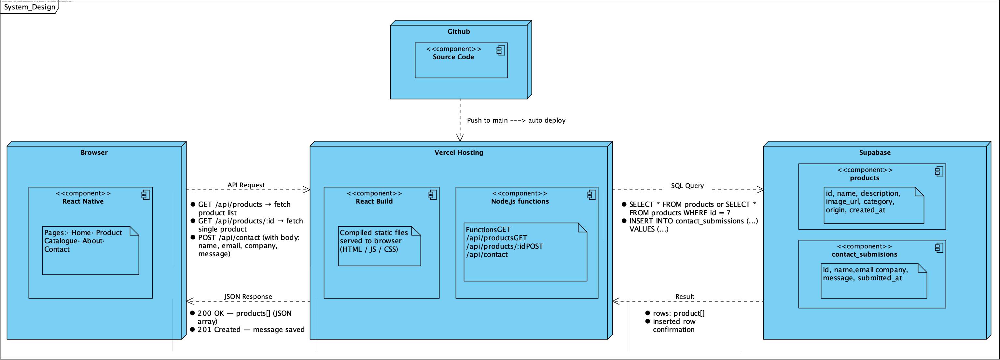

# Architecture Design – GreenEarth Produce Website

**Author:** Preslav Stoyanov
**Project:** GreenEarth Produce Website
**Date:** April 2026
**PDP Area:** Software – Analysis & Realisation (Level 2)

---

## 1. Introduction

This document describes the architecture we are planning to use for the GreenEarth Produce website. The goal of the website is to help the company reach new B2B customers in the Dutch market by showcasing their products and making it easy to get in contact.

The main things the website needs to support are a product catalogue (loaded from a database) and a contact form where visitors can send an enquiry. Based on these requirements, I chose a three-layer architecture: a React frontend, Node.js API functions, and a Supabase database — all deployed through Vercel.

---

## 2. Technology Stack

| Layer | Technology | Reason |
|---|---|---|
| Frontend | React + TypeScript | Component-based, good for multi-page sites, TypeScript helps catch errors |
| API / Backend | Node.js (Vercel Serverless Functions) | Simple API routes without needing a full server |
| Database | Supabase (PostgreSQL) | Hosted database, free tier, easy to manage |
| Hosting | Vercel | Works well with React, automatic deploys from GitHub |
| Version Control | Git / GitHub | Code management and triggering deploys |

I chose Vercel because it makes hosting a React app very simple and it also supports serverless functions which act as our backend. Supabase was chosen because it is a managed PostgreSQL database that does not require setting up a server — it has a dashboard where you can manage the data directly which is useful for the client.

---

## 3. System Architecture

The system is split into three layers.

**Presentation layer** — the React + TypeScript frontend that runs in the visitor's browser. It handles all the pages: Home, Product Catalogue, About, and Contact.

**API layer** — Node.js serverless functions hosted on Vercel. These sit between the frontend and the database. They handle incoming requests (like fetching products or submitting the contact form) and talk to Supabase.

**Data layer** — Supabase PostgreSQL database. Stores the product catalogue and contact form submissions.



---

## 4. Database Design

Two tables are needed in Supabase.

### `products` table

| Column | Type | Notes |
|---|---|---|
| id | UUID | Primary key, auto-generated |
| name | TEXT | Product name, required |
| description | TEXT | Short description |
| image_url | TEXT | Link to product image |
| category | TEXT | e.g. Fresh, Dried |
| origin | TEXT | e.g. China |
| created_at | TIMESTAMP | Auto-set on insert |

### `contact_submissions` table

| Column | Type | Notes |
|---|---|---|
| id | UUID | Primary key, auto-generated |
| name | TEXT | Visitor's full name, required |
| email | TEXT | Email address, required |
| company | TEXT | Company name |
| message | TEXT | Enquiry message, required |
| submitted_at | TIMESTAMP | Auto-set on insert |

---

## 5. API Endpoints

| Method | Endpoint | What it does |
|---|---|---|
| GET | `/api/products` | Returns all products from the database |
| GET | `/api/products/:id` | Returns one product by ID |
| POST | `/api/contact` | Saves a new contact form submission |

The database credentials (Supabase URL and API key) are stored as environment variables in Vercel and never exposed to the browser.

---

## 6. Deployment

When a developer pushes code to the main branch on GitHub, Vercel automatically picks it up and deploys the updated frontend and serverless functions. This means there is no manual deployment step needed.

*[Deployment flow diagram – to be added]*

---

## 7. Folder Structure

```
greenearthproduce/
├── frontend/
│   ├── src/
│   │   ├── components/   (Navbar, Footer, ProductCard, etc.)
│   │   ├── pages/        (Home, Catalogue, About, Contact)
│   │   └── App.tsx
│   └── package.json
├── api/
│   ├── products.ts
│   └── contact.ts
└── vercel.json
```

---

## 8. Security

- Supabase credentials are kept in Vercel environment variables, not in the code
- The frontend never talks directly to the database — everything goes through the API functions
- Contact form input is validated on the server before being stored

## Technology Decision — CBMD

### Frontend Framework

| Criteria | Weight (1-3) | React + TypeScript | Vue.js | Angular |
|---|---|---|---|---|
| Team experience | 3 | ✓✓✓ | ✓ | ✓ |
| Easy to set up | 2 | ✓✓✓ | ✓✓✓ | ✓ |
| Good documentation | 2 | ✓✓✓ | ✓✓ | ✓✓ |
| Fits multi-page site | 2 | ✓✓✓ | ✓✓✓ | ✓✓✓ |
| **Total score** | | **27** | **19** | **15** |

**Decision: React + TypeScript** — highest score, best team fit.

---

### Database

| Criteria | Weight (1-3) | Supabase | Firebase | Own MySQL |
|---|---|---|---|---|
| Free tier | 3 | ✓✓✓ | ✓✓✓ | ✗ |
| Relational data (structured) | 3 | ✓✓✓ | ✗ | ✓✓✓ |
| Easy setup | 2 | ✓✓✓ | ✓✓✓ | ✓ |
| Client can manage content | 2 | ✓✓✓ | ✓✓ | ✓ |
| **Total score** | | **30** | **22** | **16** |

**Decision: Supabase** — only option that is both free and relational.

---

### Hosting

| Criteria | Weight (1-3) | Vercel | Netlify | Own VPS |
|---|---|---|---|---|
| Auto-deploy from GitHub | 3 | ✓✓✓ | ✓✓✓ | ✗ |
| Supports API functions | 3 | ✓✓✓ | ✓✓ | ✓✓ |
| Free tier | 2 | ✓✓✓ | ✓✓✓ | ✗ |
| Easy setup | 2 | ✓✓✓ | ✓✓✓ | ✓ |
| **Total score** | | **30** | **27** | **13** |

**Decision: Vercel** — best integration with React and GitHub.

---
*✓✓✓ = 3 pts, ✓✓ = 2 pts, ✓ = 1 pt, ✗ = 0 pts. Total = score × weight per row.*
